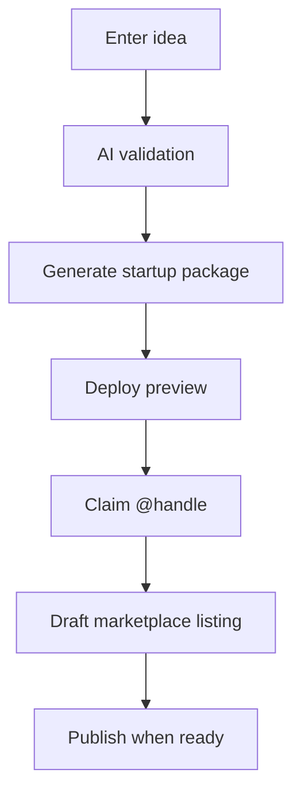

# Mr.Software 2.0 — Engineering roadmap

> **Launch first:** See **[MVP-LAUNCH-PLAN.md](./MVP-LAUNCH-PLAN.md)** and **[LAUNCH-CHECKLIST.md](./LAUNCH-CHECKLIST.md)** before post-MVP backlog items below.

Phased plan for systems beyond the MVP from the [strategic review](./STRATEGIC-REVIEW.md).

**Principles**

1. Ship **orchestration** before new isolated features.
2. Reuse existing deploy, marketplace, storefront, and AI modules.
3. Africa-first payments and storytelling stay non-negotiable.

---

## Phase overview

| Phase | System | Outcome | Priority |
|-------|--------|---------|----------|
| **A** | Startup Factory | One guided flow: idea → live product → listing | P0 |
| **B** | Live globe map | Real deployment/listing events on hero map | P1 |
| **C** | GitHub-first deploy | GitHub as default path in factory + deploy UX | P1 |
| **D** | AI startup team | Four personas with distinct outputs | P2 |
| **E** | Storefront Phase 4 | Store-level billing & customer portal | P2 |
| **F** | Payments expansion | ETB payouts, revenue split rules | P2 |

---

## Phase A — Startup Factory (P0)

### User story

> As a developer, I enter an idea and leave with a validated concept, deployed preview, storefront handle, and optional marketplace draft — without visiting five separate pages.

### Target flow



### Building blocks (already exist)

- `/app/ai` — startup advisor
- `/app/builder` — generate startup
- `/deploy` — ZIP or GitHub
- `/app/storefront` — identity
- `/listings` — publish software

### To build

| Task | Description |
|------|-------------|
| A1 | `StartupFactoryWizard` — single UI at `/app/factory` | **Shipped** |
| A2 | Persist factory **session** state (`FactorySession` model + API) | **Shipped** |
| A3 | Step: “Create storefront handle” if missing | **Shipped** |
| A4 | Step: “Create listing draft” pre-filled from startup analysis | **Shipped** |
| A5 | Progress checklist on command center (`/app`) | **Shipped** |

### Success metrics

- % of new developers completing factory without admin help
- Time from signup → first deployment URL
- Academy lesson “publish first product” completion rate

---

## Phase B — Live global map (P1)

### User story

> Visitors see real African builders launching products on the homepage globe — not only demo arcs.

### Building blocks (already exist)

- `AfricaLaunchHero`, `AfricaGlobeCanvas`, arc layers
- `lib/landing/africa-hero-data.ts` — static seeds (CampusOne, Addis hub)
- `Deployment`, `Software`, `DeveloperStorefront` models

### To build

| Task | Description |
|------|-------------|
| B1 | API `GET /api/public/launch-map` — recent public deploys + listings | **Shipped** |
| B2 | Replace static arcs with API-driven points on homepage globe | **Shipped** |
| B3 | Admin toggle: demo / live / hybrid at `/admin/site` | **Shipped** |
| B4 | `/explore/map` — full interactive launch map | **Shipped** |

### Data shape (draft)

```typescript
type LaunchMapPoint = {
  city: string;
  country: string;
  productName: string;
  handle: string;
  lat: number;
  lng: number;
  type: "deploy" | "listing" | "sale";
  occurredAt: string;
};
```

---

## Phase C — GitHub-first deployment (P1)

### User story

> Connect GitHub once, pick a repo, deploy — no ZIP unless I choose it.

### Building blocks (already exist)

- Full OAuth + `/api/github/deploy`
- `DeployGithubPanel` in `DeploymentCenter`
- Env docs in `PROJECT.md`

### To build

| Task | Description |
|------|-------------|
| C1 | Promote GitHub tab as **recommended** in deploy + factory step |
| C2 | Onboarding checklist: “Connect GitHub” for new developers |
| C3 | Post-deploy: offer “Publish to marketplace” with repo link in listing |
| C4 | Document OAuth app setup in `USER-ADMIN-GUIDE.md` § GitHub |
| C5 | (Later) GitHub Action template `mr-software/deploy-action` |

### Configuration

```env
GITHUB_CLIENT_ID=
GITHUB_CLIENT_SECRET=
```

Callback URL: `https://your-domain/api/github/callback`

---

## Phase D — AI startup team (P2)

### User story

> Every startup gets four AI teammates with clear roles; I see their outputs in one dashboard.

### Role definitions

See [`lib/ai/startup-team.ts`](../lib/ai/startup-team.ts).

| Role | Delivers |
|------|----------|
| **Human Founder** | Idea, decisions, approval |
| **Mr Strategist** | Validation, market, pricing (startup advisor today) |
| **Mr Designer** | Color/type suggestions, hero copy, logo brief |
| **Mr Developer** | Architecture, module list, deploy steps |
| **Mr Marketer** | Launch post, tagline variants, storefront bio |

### To build

| Task | Description |
|------|-------------|
| D1 | Team panel UI on startup preview page |
| D2 | Separate prompts per role (`lib/ai/prompts/team/*.ts`) |
| D3 | Export “Launch pack” PDF/markdown |
| D4 | Wire marketer output → storefront tagline/bio prefill |

---

## Phase E — Storefront Phase 4 (P2)

From vision doc — store-level subscriptions sold on `@handle`, customer portal per store.

Depends on: entitlements model extension, Stripe Connect or manual payout rules.

---

## Phase F — Payments expansion (P2)

- Chapa/Telebirr checkout on more surfaces
- Developer payout dashboard (ETB)
- Revenue share rules for marketplace vs direct store sales

---

## Already shipped (do not rebuild)

Use this checklist when planning sprints:

- [x] Developer storefronts `/@handle` + themes + social links
- [x] Developer access request queue (`/admin/developer-requests`)
- [x] Academy CMS + public catalog
- [x] Reports queue (user submit + admin triage)
- [x] Portal routing (`/app/marketplace`, `/app/software/[id]`)
- [x] Africa globe hero with **live data** (`/api/public/launch-map`, `/explore/map`)
- [x] GitHub OAuth deploy
- [x] Startup Factory wizard (`/app/factory`) with session persistence
- [x] Stripe entitlements + downloads

---

## Suggested sprint order (next 90 days)

| Sprint | Focus |
|--------|--------|
| 1 | Phase A1–A2 — Factory wizard shell + session state |
| 2 | Phase A3–A4 — Storefront + listing draft from factory |
| 3 | Phase C1–C3 — GitHub prominence + post-deploy listing |
| 4 | Phase B1–B2 — Live map API + hero integration |
| 5 | Phase D1–D2 — AI team UI + strategist/designer split |

---

## Links

- Vision: [`MR-SOFTWARE-2.0-VISION.md`](./MR-SOFTWARE-2.0-VISION.md)
- Strategic review: [`STRATEGIC-REVIEW.md`](./STRATEGIC-REVIEW.md)
- Technical inventory: [`PROJECT.md`](./PROJECT.md)
- Operations: [`USER-ADMIN-GUIDE.md`](./USER-ADMIN-GUIDE.md)
