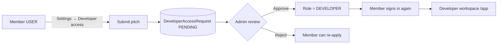

# Mr.Software — User & Admin Guide

Complete guide to **who can do what**, **where each feature lives**, and **how requests flow** between members, developers, and admins.

---

## Table of contents

1. [Roles at a glance](#1-roles-at-a-glance)
2. [Public site vs signed-in portal](#2-public-site-vs-signed-in-portal)
3. [Member (USER) guide](#3-member-user-guide)
4. [Developer access requests](#4-developer-access-requests)
5. [Developer (DEVELOPER) guide](#5-developer-developer-guide)
6. [Admin (ADMIN) guide](#6-admin-admin-guide)
7. [Marketplace & products](#7-marketplace--products)
8. [Developer storefronts](#8-developer-storefronts)
9. [Settings](#9-settings)
10. [Reports & moderation](#10-reports--moderation)
11. [Academy](#11-academy)
12. [Team & landing page content](#12-team--landing-page-content)
13. [Troubleshooting](#13-troubleshooting)

---

## 1. Roles at a glance

| Role | Label in UI | Can browse & buy | Can deploy & list products | Admin console |
|------|-------------|------------------|----------------------------|---------------|
| **USER** | Member | Yes | No — must request promotion | No |
| **DEVELOPER** | Developer | Yes | Yes (deploy, storefront, listings) | No |
| **ADMIN** | Admin | Yes (via admin tools) | Yes | Yes — `/admin` |

Additional flags on every account (set by admin in **Users**):

- **canUpload** — allow ZIP deploy uploads
- **canPublish** — allow marketplace listings
- **canWithdraw** — allow payout-related actions

Account **status** must be **ACTIVE** to use the product. Other statuses: `RESTRICTED`, `SUSPENDED`, `BANNED`.

---

## 2. Public site vs signed-in portal

### Public (logged out)

Uses the marketing header (Features, Marketplace, Academy, …) and footer.

| URL | Purpose |
|-----|---------|
| `/` | Landing page |
| `/marketplace` | Public software catalog |
| `/software/[id]` | Product detail + download/purchase |
| `/academy` | Academy course catalog |
| `/academy/[slug]` | Course + lessons |
| `/@handle` or `/store/[handle]` | Developer storefront |
| `/auth/login`, `/auth/register` | Sign in / sign up |
| `/report` | Submit a report (requires login for submit) |

### Portal (logged in as USER or DEVELOPER)

Uses the **workspace shell** — sidebar, top bar, no marketing header.

Middleware automatically redirects signed-in members and developers:

| Public URL | Redirects to |
|------------|--------------|
| `/marketplace` | `/app/marketplace` |
| `/software/[id]` | `/app/software/[id]` |
| `/@handle` | `/app/store/[handle]` |

**Admins** stay on public storefront URLs when browsing others’ stores.

Signed-in header links (when you do see the site header, e.g. on `/academy`):

- **My library** / **Workspace** → `/app/home` or `/app`
- **Marketplace** → `/app/marketplace`
- **Storefront** (developers only) → `/app/storefront`

---

## 3. Member (USER) guide

### Where members land

After login, **USER** accounts go to **`/app/home`** (My library).

Sidebar:

| Item | Path | Purpose |
|------|------|---------|
| Home | `/app/home` | Dashboard, recommendations |
| Mr.Software AI | `/app/ai` | AI hub |
| Marketplace | `/app/marketplace` | Browse & open products |
| My software | `/app/my-software` | Products you own / downloaded |
| Billing | `/app/billing` | Purchases & subscriptions |
| Settings | `/app/settings` | Profile, security, notifications, **developer access** |

### What members can do

- Browse marketplace and open product pages (inside portal layout)
- Download free products or purchase paid ones (when checkout is configured)
- Manage profile, password, theme, notifications
- **Request developer access** (see next section)
- Report listings, storefronts, or users via **Report** buttons or `/report`

### What members cannot do

- Deploy ZIP apps (`/deploy` requires DEVELOPER)
- Create marketplace listings or a public storefront
- Access `/admin`

A banner on the home library explains deploy restrictions and links to **Request developer access**.

---

## 4. Developer access requests

This is the **official path** for members to become developers. You no longer need to email an admin manually (though admins can still promote users directly).

### Member: how to submit

1. Sign in as a **member** (USER).
2. Open **Settings** → **Developer access**  
   Direct link: **`/app/settings#developer`**
3. Fill in:
   - **Pitch** (required, 20–2000 chars) — what you’ll build or sell, experience, why you need deploy/listing access
   - **Portfolio / website** (optional)
4. Click **Request developer access**.

**Statuses you’ll see:**

| Status | Meaning | What to do |
|--------|---------|------------|
| **Pending** | Waiting for admin | Wait; your pitch is shown read-only |
| **Approved** | Promoted to DEVELOPER | **Sign out and sign back in** to load developer workspace |
| **Rejected** | Not approved | Read admin note (if any); you may submit again |

Only one **pending** request at a time. Developers and admins do not use this form.

### Admin: how to review

1. Sign in as **admin** → **`/admin`**
2. Open **Dev requests** in the sidebar, or follow the overview alert:  
   **`/admin/developer-requests`**
3. For each pending request you see:
   - Member name & email
   - Pitch and optional link
   - Optional **note to member** (shown if rejected)
4. Actions:
   - **Approve & promote to Developer** — sets role to `DEVELOPER`, invalidates their session (they must re-login)
   - **Reject** — keeps them as USER; optional note stored

Approved actions are written to the **audit log** (`developer_access.approve` / `developer_access.reject`).

### Admin: manual promotion (alternative)

**Admin → Users** (`/admin/users`) → find user → **Role** dropdown → select **DEVELOPER**.

Use this for invites, corrections, or skipping the request queue.

### Flow diagram



### API (for integrators)

| Method | Path | Who |
|--------|------|-----|
| `GET` | `/api/developer-access` | Member — current request status |
| `POST` | `/api/developer-access` | Member — submit request |
| `GET` | `/api/admin/developer-requests?status=PENDING` | Admin — list queue |
| `PATCH` | `/api/admin/developer-requests/[id]` | Admin — `{ "action": "approve" \| "reject", "adminNote": "..." }` |

---

## 5. Developer (DEVELOPER) guide

After promotion, sign out and back in. You get the **developer workspace shell** (command center sidebar).

### Main routes

| Area | Path | Purpose |
|------|------|---------|
| Command center | `/app` | Overview, stats, shortcuts |
| Mr.Software AI | `/app/ai` | AI tools |
| Storefront | `/app/storefront` | Handle, bio, theme, **social links**, revenue display |
| Public store | `/@your-handle` | What customers see |
| Deploy | `/deploy` | Upload ZIP hosting |
| Projects | `/projects` | Hosted deployments |
| Revenue | `/earnings` | Sales summary |
| My listings | `/listings` | Your marketplace products |
| Billing / plan | `/payouts` | Workspace Pro upgrade |
| Settings | `/settings` | Account settings (developer path) |

### Storefront social links

In **Storefront settings** (`/app/storefront`), section **Social profiles**:

Supported platforms: X (Twitter), GitHub, LinkedIn, Instagram, YouTube, TikTok, Threads, Facebook.

- Enter `@username` or full URL — saved normalized as HTTPS links
- Icons appear on public store under **Follow elsewhere**
- Also shown on **product detail** pages in the developer card

### Creating a listing

1. Ensure role is DEVELOPER and account is ACTIVE.
2. Use listings flow from `/listings` or API `POST /api/software` (subject to `canPublish`).
3. Product appears on `/marketplace` and your `/@handle` grid.

---

## 6. Admin (ADMIN) guide

**URL:** `/admin` (members/developers are redirected away from `/app` to admin if they are ADMIN).

### Sidebar map

| Page | Path | Purpose |
|------|------|---------|
| Overview | `/admin` | Stats, alerts, recent audit |
| Users | `/admin/users` | Roles, status, upload/publish/withdraw flags |
| **Dev requests** | `/admin/developer-requests` | **Approve member → developer** |
| Software | `/admin/software` | Catalog overview |
| Deployments | `/admin/deployments` | Deploy status / failures |
| Payments | `/admin/payments` | Purchases |
| Reports | `/admin/reports` | User-submitted abuse reports queue |
| Moderation | `/admin/moderation` | Governance shortcuts |
| System | `/admin/system` | Operator notes |
| Site | `/admin/site` | Logo, partners CMS |
| Team | `/admin/team` | Landing page team section |
| Academy | `/admin/academy` | Courses, lessons, section copy |
| Testimonials | `/admin/testimonials` | Landing quotes review |
| Storefronts | `/admin/storefronts` | Verify / feature creators |
| Audit log | `/admin/audit` | Privileged action history |
| Settings | `/admin/settings` | Admin account settings |

### Overview alerts

The admin home page surfaces actionable counts, including:

- Failed deployments
- Non-active users
- Pending purchases
- Pending testimonials
- **Pending developer access requests** → `/admin/developer-requests`
- Open reports (via reports page)

---

## 7. Marketplace & products

### Catalog

| Audience | URL | Layout |
|----------|-----|--------|
| Public | `/marketplace` | Site chrome |
| Signed in | `/app/marketplace` | Portal sidebar |

Features: search, category filters, sort (featured, name, free first), spotlight row.

### Product detail

| Audience | URL |
|----------|-----|
| Public | `/software/[id]` |
| Signed in | `/app/software/[id]` (auto-redirect) |

Page includes:

- Cover, description, metrics (views, license, platforms)
- **Get this product** — download or checkout (Stripe / Chapa / Telebirr when configured)
- **Published by** — developer card with verified badge, link to storefront, **social icons**
- **Report** — flag listing (disabled for owner)

### Ownership

The developer card always shows the **listing owner**, not the logged-in viewer. If you are the owner, you see **Your listing** and **Manage in workspace →** (`/listings`).

---

## 8. Developer storefronts

### Public URLs

- `https://yoursite/@handle` (rewrite)
- `https://yoursite/store/handle`

### Logged-in viewing

Browsing `/@handle` while signed in redirects to **`/app/store/[handle]`** so you keep the portal sidebar.

### Storefront themes

Classic, Minimal, Bold, Midnight — chosen in `/app/storefront`.

### Admin: verified & featured

**Admin → Storefronts** — toggle **verified** and **featured** (featured row on marketplace landing).

---

## 9. Settings

**Members:** `/app/settings`  
**Developers:** `/settings`

Settings uses **tabs** (one section at a time — no long scroll):

| Tab | Contents |
|-----|----------|
| Profile | Name, email, member since |
| Appearance | Light / dark theme |
| Security | Password, Google sign-in |
| **Developer access** | **Members only** — request form |
| Notifications | In-app, push, email digest |
| Session | Log out on this device |

Deep links: `/app/settings#notifications`, `/app/settings#developer`, etc.

---

## 10. Reports & moderation

### Submitting a report

- Product page → **Report** button
- Storefront → **Report**
- Dedicated page: **`/report`** (with target query params when linked from elsewhere)

Requires login. Cannot report your own listing/store.

Reasons: spam, scam, copyright, inappropriate, misleading, other.

### Admin triage

**Admin → Reports** (`/admin/reports`)

Filter: Open, Reviewing, Resolved, Dismissed.

Actions: update status, add resolution notes.

API: `GET /api/admin/reports`, `PATCH /api/admin/reports/[id]`, public `POST /api/reports`.

---

## 11. Academy

### Public

- **`/academy`** — course catalog with levels, duration, descriptions
- **`/academy/[slug]`** — course detail + lesson reader (markdown-style content)
- Progress tracked when logged in

### Admin

**Admin → Academy** (`/admin/academy`)

- Edit section headline copy (eyebrow, title, tagline, intro)
- CRUD courses and lessons (slug, summary, duration, sort order, markdown body)
- API under `/api/admin/academy/*`

---

## 12. Team & landing page content

| Content | Admin path | Public anchor |
|---------|------------|---------------|
| Team members | `/admin/team` | `/#team` |
| Testimonials | `/admin/testimonials` | `/#testimonials` |
| Partners & logo | `/admin/site` | `/#partners` |
| Features, CTA | Code / landing components | `/#features` |

---

## 13. Troubleshooting

### “Unable to load” in admin (Academy, Reports, …)

Often a **stale Prisma client** after schema changes.

```bash
npx prisma db push
npx prisma generate
# Restart npm run dev
```

### Approved as developer but still see member UI

**Sign out and sign back in.** Role changes bump `sessionVersion`; old JWT keeps previous role until refresh.

### Marketplace opens without sidebar

Ensure you’re on **`/app/marketplace`**, not `/marketplace`. Logged-in users should redirect automatically; hard-refresh if needed.

### Developer access form missing

Tab only appears for role **USER**. Developers use `/settings`; admins use `/admin`.

### Social icons not on product page

Developer must save links in **Storefront settings**; icons appear when at least one valid link exists.

### Seed demo data

| Account | Email | Password | Role |
|---------|-------|----------|------|
| Member | `mock.user@mrsoftware.local` | `password123` | USER |
| Developer | `dev@mrsoftware.local` | `password123` | DEVELOPER |
| Admin | `admin@mrsoftware.local` | `password123` | ADMIN |

Catalog products belong to **Dev Studio** (`@devstudio`), not your personal account unless you publish your own.

---

## Related technical docs

Engineering details (API tables, Prisma models, middleware, env vars): **[PROJECT.md](./PROJECT.md)**

Product vision: **[MR-SOFTWARE-2.0-VISION.md](./MR-SOFTWARE-2.0-VISION.md)**

---

*Last updated: June 2026 — includes developer access requests, portal routing, academy CMS, reports queue, storefront social links, and tabbed settings.*
